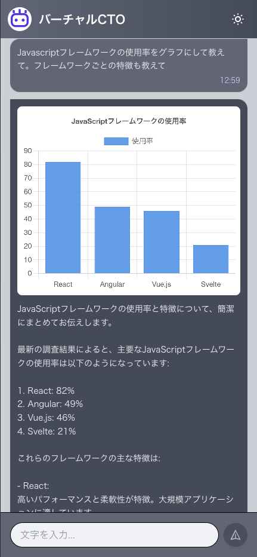

## バーチャルCTO
AIを利用したシステム開発・技術相談のできるチャットボット  


## 技術スタック
Laravel  
PHP  
Vue  
Sonar Pro (Perplexity)

## 実装方法
Perplexity(AIモデルはClaude3.7 sonnet)でコード生成  
APIでのAI分析では、過去の会話を覚えていないので会話履歴を含める

## 環境構築
SailでDockerコンテナ起動
```
./vendor/bin/sail up
```

依存関係のインストール
```
./vendor/bin/sail composer install
./vendor/bin/sail pnpm install
```

マイグレーション、シーディング
```
./vendor/bin/sail artisan migrate --seed
```

下記にアクセス
```
http://localhost
```